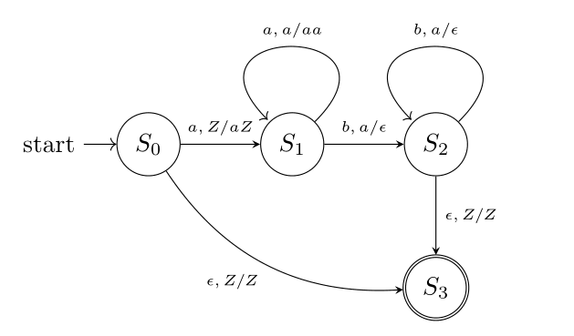

# Pushdown Automata with Java Tokeniser and Parser

This repository contains a tokeniser and a parser with Java which demonstrate
the implementation of formal grammar and a pushdown automaton.

The example grammar has the following production rules:
- $S \to \epsilon$
- $S \to aSb$

The corresponding pushdown automaton as define with the following transitions:
- $\delta (S_{0}, \epsilon, Z) \mapsto S_{3}/Z$
- $\delta (S_{0}, a, Z) \mapsto S_{1}/aZ$
- $\delta (S_{1}, a, a) \mapsto S_{1}/aa$
- $\delta (S_{1}, b, a) \mapsto S_{2}/\epsilon$
- $\delta (S_{2}, b, a) \mapsto S_{2}/\epsilon$
- $\delta (S_{2}, \epsilon, Z) \mapsto S_{3}/Z$

The stack starts with $Z$.
$S_{0}$ is the starting state whilst $S_{3}$ is the terminal state.

@author: Alvin Tang <dev@alvinylt.net>

@last-updated: 2023-04-30
